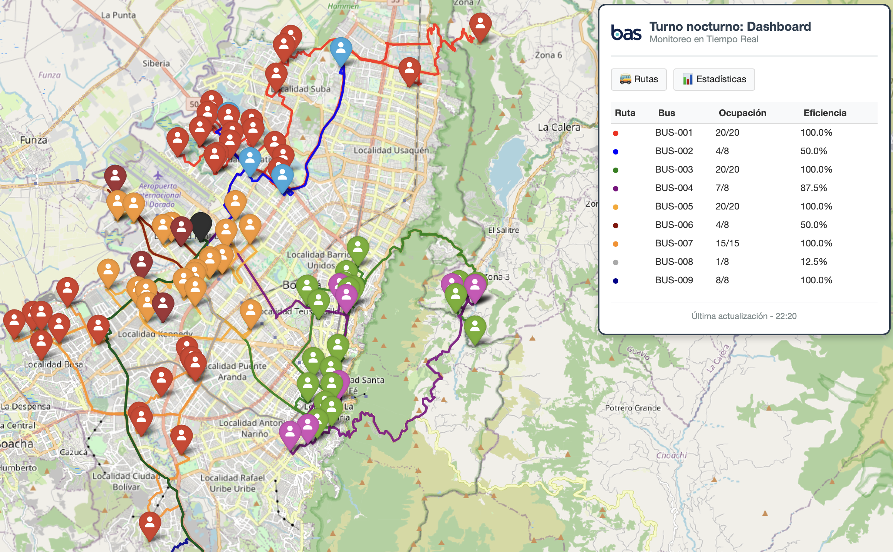

# Bas - Sistema de Optimización de Transporte


## Descripción
Sistema completo de optimización de rutas para transporte corporativo nocturno. Procesa, planifica y asigna rutas eficientes en menos de 3 minutos.

## Explicación



[](https://drive.google.com/file/d/14458TodzGvxMZKEBKeTrlX5ih5_rQXht/view?usp=sharing)

## Como Ejecutar el Proyecto

### 1. Clonar el Repositorio

```bash
git clone https://github.com/qcrbellor/night-shift.git
cd night-shift
```
### 2. Instalar Dependencias

```bash
pip install -r requirements.txt
```
### 3. Ejecutar

```python
src/main.py
```
### 4. Resultados

El sistema generará:

- bas_routes_map.html - Mapa interactivo con rutas
- json/ - Datos para apps móviles
- img/ - Gráficas estadísticas

## Contacto

<p>
<a href="mailto:crbellor@unal.edu.co?Subject=Interest in working with you" target="_blank">
    
<a href="https://www.linkedin.com/in/cristian-eliecer-bello-reyes-46b1b91ba/" target="_blank">
    
</a>
</p>
Last Edited on: 03/09/2025